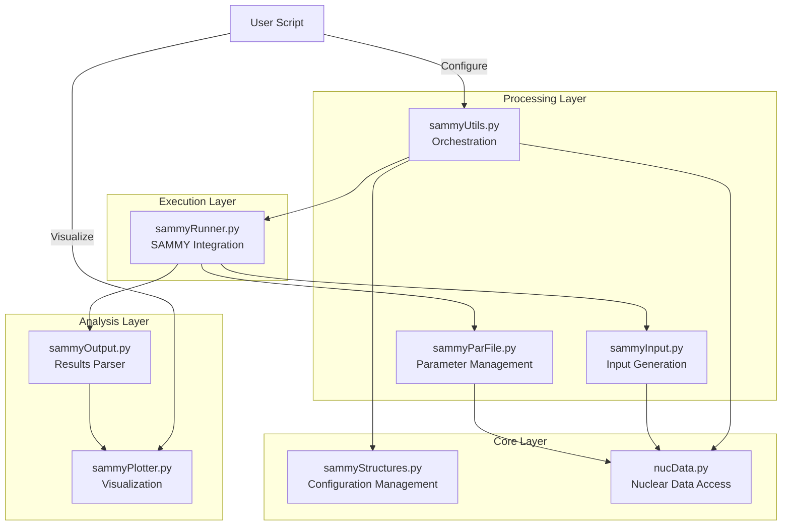

# PLEIADES Architecture Documentation

This document is the design document for PLEIADES(v1), followed by suggestions on refactoring and enhancements.

## Overview

PLEIADES is a computational platform designed for neutron resonance analysis, with a focus on SAMMY integration and workflow management. The architecture follows a layered design with clear separation between configuration, execution, and analysis components.

## System Architecture

The system is divided into four main layers:

1. **Core Layer**: Core configuration management and nuclear data access
1. **Processing Layer**: Workflow orchestration and input generation
1. **Execution Layer**: SAMMY execution and parameter management
1. **Analysis Layer**: Results parsing and visualization



## Module Details

| Module | Key Components | Complexity | Summary |
|--------|---------------|------------|----------|
| sammyStructures.py | `SammyFitConfig`, `sammyRunConfig` | High | Core configuration management system handling parameter storage, validation, and directory structures |
| nucData.py | `get_mass_from_ame()`, `extract_isotope_info()`, `get_info()` | Medium | Nuclear data access layer providing isotope information and atomic mass calculations |
| sammyUtils.py | `create_parFile_from_endf()`, `configure_sammy_run()`, `run_sammy()` | High | High-level orchestrator managing workflow and coordinating between modules |
| sammyRunner.py | `run_sammy_fit()`, `check_sammy_environment()` | Medium | SAMMY execution manager handling both local and Docker environments |
| sammyInput.py | `InputFile` class | Medium | SAMMY input file generator with format-specific handlers |
| sammyParFile.py | `ParFile`, `Update` classes | High | Parameter file manager supporting complex operations on SAMMY par files |
| sammyOutput.py | `lptResults` class | Medium | Output parser extracting fit results from SAMMY output files |
| sammyPlotter.py | `process_and_plot_lst_file()` | Low | Visualization tools for SAMMY results |
| simData.py | `create_transmission()`, `Isotope` class | Low | Simulation support for transmission data |

## Example Workflow

The following example demonstrates a typical workflow using PLEIADES for SAMMY analysis:

```python
# 1. Configuration Setup
from pleiades import sammyUtils, sammyPlotter
config = sammyUtils.SammyFitConfig("uranium.ini")

# 2. Generate Parameter Files
sammyUtils.create_parFile_from_endf(config, verbose_level=1)

# 3. Configure SAMMY Run
sammy_run = sammyUtils.configure_sammy_run(config, verbose_level=1)

# 4. Execute SAMMY Fit
sammyUtils.run_sammy(config, verbose_level=1)

# 5. Analyze Results
sammyPlotter.process_and_plot_lst_file(
    f"{config.params['directories']['sammy_fit_dir']}/results/SAMMY.LST",
    residual=True,
    quantity="transmission"
)

# Optional: Iterative Refinement
# Update isotopes/parameters and rerun
config.params["isotopes"]["names"].append("Ta-181")
config.params["isotopes"]["abundances"].append(0.01)
sammy_run = sammyUtils.configure_sammy_run(config, verbose_level=1)
```

Key Workflow Steps:

1. Initialize configuration from `INI` file
2. Generate parameter files from `ENDF` data
3. Configure SAMMY run environment
4. Execute SAMMY fit
5. Analyze and visualize results
6. [Optional] Iterate with parameter refinements

The system supports both simple workflows and complex scenarios involving multiple isotopes and iterative refinement of fits.

## Opportunities for Enhancement

### Core Considerations

1. **SAMMY Integration Requirements**
    - The existing codebase effectively handles SAMMY's fixed-width format requirements
    - This core functionality must be preserved during any refactoring
    - Format definitions and card structures are essential and cannot be simplified

1. **Class Organization**
    - The `ParFile` and `InputFile` classes successfully manage complex SAMMY requirements
    - Could benefit from internal reorganization while maintaining external interfaces
    - Consider using composition for different card types while keeping format compliance

    ```python
    # Current approach works but could be reorganized internally
    class ParFile:
        def __init__(self):
            self._SPIN_GROUP_FORMAT = {...}  # Essential format definition
            self._CHANNEL_RADII_FORMAT = {...}
    ```

### Implementation Opportunities

1. **Type System Enhancement**
    - Adding type hints could improve code maintainability
    - Would help new developers understand data structures better

    ```python
    # Potential enhancement while maintaining functionality
    def parse_spin_group(self, data: SpinGroupData) -> SpinGroupCard:
        """Parse spin group data into SAMMY-compliant format"""
    ```

1. **File Handling Consistency**
    - Consider standardizing on `pathlib` for path operations
    - Maintain robust file handling while improving consistency

    ```python
    # Standardize on pathlib while keeping functionality
    symlink_path = pathlib.Path(fit_dir) / "res_endf8.endf"
    ```

1. **Input Validation**
    - Could consolidate validation while maintaining format requirements
    - Early validation would help users identify issues sooner

### Testing and Documentation

1. **Test Coverage**
    - Add unit tests to ensure format compliance
    - Create test fixtures for common SAMMY input scenarios
    - Validate output formats match SAMMY requirements

1. **Documentation Enhancement**
    - Expand docstrings for complex format handling
    - Add examples of correct SAMMY input generation
    - Document format requirements clearly

### Performance Considerations

1. **Resource Management**
    - Review file handling patterns
    - Consider streaming for large files where possible

    ```python
    # Potential enhancement for large files
    def process_large_file(self, filename: Path) -> Iterator[str]:
        with filename.open() as f:
            for line in f:
                yield self.process_line(line)
    ```

### Future Development Opportunities

1. **Module Organization**
    - Consider grouping related SAMMY format handlers
    - Maintain format compliance while improving code organization

1. **Error Handling**
    - Enhance error messages for format-related issues
    - Help users understand SAMMY's requirements better

The original implementation effectively manages SAMMY's complex requirements. These suggestions aim to build upon that foundation while maintaining full compatibility with SAMMY's fixed-width format requirements.
