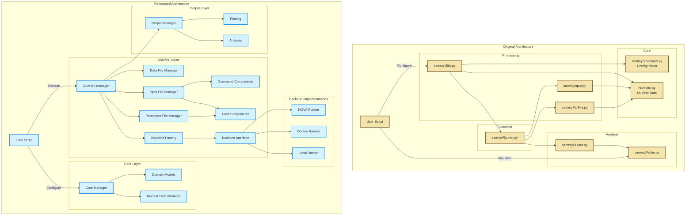

# PLEIADES Refactoring Design Document

## Background

PLEIADES is a library that help users prepare input files to use with SAMMY, a nuclear simulation software.
The current implementation of PLEIADES is functional, but facing the following challenges:

1. Tight Coupling: Core components are tightly coupled, making it difficult to modify one component without affecting others.
1. Complex File Handling: Parameter file management spreads across multiple modules with duplicated logic.
1. Error Handling: Inconsistent error handling patterns across modules.
1. Type Safety: Lack of type hints makes code harder to maintain and more prone to runtime errors.
1. Testing Complexity: Tightly coupled components make unit testing difficult

## Refactoring Goals

1. Modular Architecture

    - Clear separation of concerns between components
    - Decoupled interfaces between modules
    - Composition-based design for parameter file handling

1. Enhanced Backend Support

    - Abstract SAMMY execution interface
    - Support for local, Docker, and NOVA backends
    - Extensible design for future backend additions

1. Robust Data Management

    - Centralized nuclear data access
    - Type-safe data models (via Pydantic)
    - Efficient caching mechanisms

1. Improved Error Handling

    - vConsistent error handling patterns
    - Clear error hierarchies
    - Descriptive error messages

1. Type Safety and Validation

    - Comprehensive type hints
    - Runtime validation using Pydantic models
    - Format validation for SAMMY inputs

1. Testability

    - Unit testable components
    - Clear interfaces for mocking
    - Comprehensive test coverage

## System Architecture

**Proposed** Architecture (left) vs. **Original** Architecture (right):

Key architectural decisions:

1. Core Layer Consolidation

    - Centralized data management through DataManager replaces scattered nuclear data access
    - Type-safe domain models using `Pydantic` for consistency and validation
    - Clear separation between data access and business logic
    - Improved caching and error handling for nuclear data operations

1. SAMMY Layer Modularization

    - Complete separation of three key file types:
        - Parameter file (.par) - resonance parameters and physical constants
        - Input file (.inp) - execution control and commands
        - Data file (.dat) - experimental data
    - Each file type managed by dedicated components:
        - Parameter File Manager with modular card components
        - Input File Manager with commands and card components
        - Data File Manager for transmission/cross-section data
    - Backend abstraction using Factory pattern for flexible execution

1. File Generation Components

    - Card Components: Reusable building blocks for both parameter and input files
        - Strong typing for each card type
        - Validation rules enforced through models
        - Fixed-width format handling utilities
    - Command Components: Specialized for input file generation
        - Consistent command formatting
        - Validation of command combinations
        - Default configurations

1. Backend System Enhancement

    - Abstract Backend Interface allowing multiple implementations
    - Three supported execution methods:
        - Local SAMMY installation
        - Docker containerization
        - NOVA web service integration
    - Runtime backend selection and validation
    - Environment-aware configuration
    - Consistent error handling across backends

1. Output Processing Improvements

    - Complete decoupling of execution and analysis
    - Unified output collection interface
    - Flexible analysis pipeline
    - Modular visualization components
    - Format conversion utilities

1. Cross-Cutting Improvements

    - Comprehensive error hierarchies
    - Consistent logging patterns
    - Configuration validation
    - Type safety throughout
    - Unit test support

## Refactoring Guidelines

Core Development Principles

1. Type Safety
   - Implement comprehensive type hints for all functions and classes
   - Enforce type checking during development and CI

1. Data Models
   - Use `Pydantic` (v2) for data container classes and validation
   - Define clear data structures for nuclear physics quantities
   - Validate data at system boundaries

1. Error Handling
   - Define module-specific exception hierarchies
   - Provide physics-relevant error messages
   - Handle errors at appropriate abstraction levels

1. Module Design
   - Each module serves single, well-defined purpose
   - Clear interfaces between components
   - Minimize inter-module dependencies
   - Prefer composition over inheritance
   - Provide example usage in module docstrings or the `__main__` block.

1. Testing
   - Unit tests required for all new modules
   - Test physics edge cases and error conditions
   - Mock external dependencies (SAMMY, filesystem)
   - Maintain test coverage targets

### Implementation Process

1. Review original module functionality
1. Design new module interface and data structures
1. Implement core features with type safety and validation
1. Add comprehensive unit tests
1. Migrate dependent code gradually
1. Document new interfaces and behaviors

### Reference Implementations

When in doubt, refer to the completed modules for guidance.
