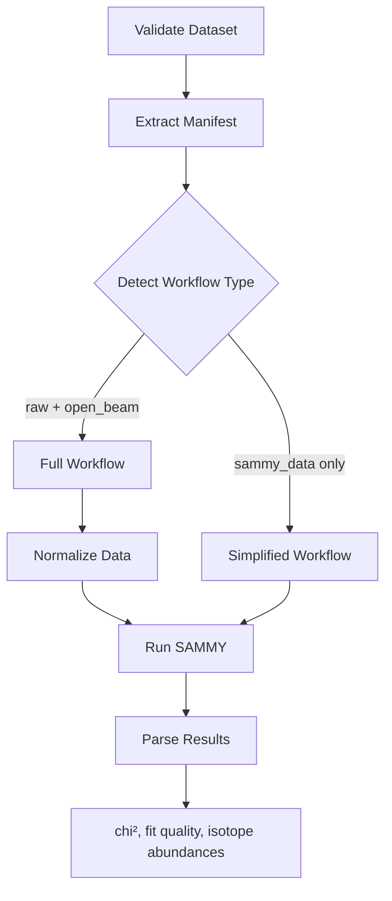

# PLEIADES MCP Server

PLEIADES provides an optional MCP (Model Context Protocol) server that enables AI-assisted neutron resonance analysis. The MCP server exposes PLEIADES workflow functions as tools that AI applications (Claude Code, Claude Desktop, Cursor, etc.) can invoke.

> **Note**: MCP support is available in PLEIADES v2.2.0+

## What is MCP?

[Model Context Protocol](https://modelcontextprotocol.io/) is an open standard for connecting AI applications to external systems. It provides a standardized way for AI models to access data sources, use tools, and execute workflows. Think of it as "USB-C for AI applications."

## Installation

### From PyPI

```bash
pip install pleiades-neutron[mcp]
```

### Editable Install (Development)

```bash
git clone https://github.com/lanl/PLEIADES.git
cd PLEIADES
pip install -e ".[mcp]"
```

### Using Pixi

```bash
pixi install -e mcp
pixi run mcp-server
```

## Quick Start

### 1. Start the MCP Server

```bash
# Using console script
pleiades-mcp

# Or using module invocation
python -m pleiades.mcp
```

### 2. Register with Claude Code

Create a `.mcp.json` file in your project directory:

```json
{
  "mcpServers": {
    "pleiades": {
      "command": "pleiades-mcp"
    }
  }
}
```

For Pixi-based projects:

```json
{
  "mcpServers": {
    "pleiades": {
      "command": "pixi",
      "args": ["run", "mcp-server"]
    }
  }
}
```

### 3. Use with Claude Code

Once registered, Claude Code will automatically connect to the PLEIADES MCP server. You can then make natural language requests:

- "Validate the dataset at ./datasets/hafnium"
- "Extract the manifest from this resonance data"
- "Analyze the neutron resonance data using the Docker backend"

## Workflow Overview

The MCP tools orchestrate the following workflow:



## Available Tools

### `validate_resonance_dataset`

Validate a neutron resonance dataset structure and check readiness for analysis.

**Parameters:**
| Name | Type | Required | Description |
|------|------|----------|-------------|
| `dataset_path` | string | Yes | Path to the dataset directory |

**Returns:** Validation result with:
- `valid`: Overall validity status
- `can_run_full_workflow`: Whether full imaging workflow is available
- `can_run_simplified_workflow`: Whether SAMMY-only workflow is available
- `recommended_workflow`: `"full"`, `"simplified"`, or `None`
- `issues`: List of validation issues with severity and messages

### `extract_resonance_manifest`

Extract and parse the manifest from a neutron resonance dataset.

**Parameters:**
| Name | Type | Required | Description |
|------|------|----------|-------------|
| `dataset_path` | string | Yes | Path to the dataset directory |

**Manifest file search order:**
1. `manifest_intermediate.md`
2. `smcp_manifest.md`
3. `manifest.md`

**Returns:** Manifest data including:
- `name`, `description`, `version`: Basic metadata
- `facility`, `beamline`, `detector`: Experiment info
- `isotope`: Primary isotope (e.g., "Hf-177")
- `isotopes`: Explicit isotope list (takes priority over natural abundance)
- `material_properties`: Density, atomic mass, temperature

See [Manifest Format](manifest-format.md) for complete specification.

### `analyze_resonance`

Perform neutron resonance analysis on a dataset using SAMMY.

**Parameters:**
| Name | Type | Required | Default | Description |
|------|------|----------|---------|-------------|
| `dataset_path` | string | Yes | - | Path to the dataset directory |
| `backend` | string | No | `"auto"` | SAMMY backend: `"auto"`, `"local"`, or `"docker"` |
| `isotopes` | list[str] | No | `None` | Specific isotopes to analyze (e.g., `["Hf-177", "Hf-178"]`) |

**Isotope Selection Priority:**

When determining which isotopes to analyze, PLEIADES uses this priority order:

1. **`isotopes` parameter** (highest priority) - If you pass isotopes to the function
2. **Manifest `isotopes` field** - Explicit list in the manifest file
3. **Manifest `enrichment` field** - Custom isotope composition (when `use_natural_abundance: false`)
4. **Natural abundance lookup** (default) - Uses PLEIADES isotope database

**Returns:** Analysis result with:
- `success`: Whether analysis completed
- `workflow_type`: `"simplified"` or `"full"`
- `chi_squared`, `reduced_chi_squared`: Fit quality metrics
- `fit_quality`: `"excellent"`, `"good"`, `"acceptable"`, or `"poor"`
- `isotope_results`: Per-isotope abundances and uncertainties
- `output_dir`, `lpt_file`, `lst_file`: Output file paths

## Output Format

All tools return JSON-serializable dictionaries with a consistent format:

**Success:**
```json
{
  "status": "success",
  "data": {
    "valid": true,
    "recommended_workflow": "simplified",
    ...
  }
}
```

**Error:**
```json
{
  "status": "error",
  "error": "Dataset validation failed: missing sammy_data/ directory"
}
```

**Common error messages:**
- `"No manifest found in /path (searched: manifest_intermediate.md, smcp_manifest.md, manifest.md)"`
- `"Dataset validation failed: ..."`
- `"SAMMY execution failed: ..."`
- `"No SAMMY backend available"`
- `"ENDF parameter file not found for isotope: Hf-999"`

## Backend Options

The `analyze_resonance` tool supports multiple SAMMY execution backends:

| Backend | Description | Requirements |
|---------|-------------|--------------|
| `auto` | Auto-detect best available (tries Docker first, then local) | Any of the below |
| `local` | Run SAMMY binary directly | SAMMY installed locally |
| `docker` | Run SAMMY in Docker container | Docker installed and running |

> **Note**: The `nova` backend (ORNL NOVA service) is currently disabled due to package instability.

## Programmatic Usage

You can also use the MCP tools directly in Python without the server:

```python
from pleiades.mcp.tools import (
    validate_resonance_dataset,
    extract_resonance_manifest,
    analyze_resonance,
)

# Validate a dataset
result = validate_resonance_dataset("/path/to/dataset")
if result["status"] == "success":
    data = result["data"]
    print(f"Valid: {data['valid']}")
    print(f"Recommended workflow: {data['recommended_workflow']}")
    for issue in data.get("issues", []):
        print(f"  [{issue['severity']}] {issue['message']}")
else:
    print(f"Validation error: {result['error']}")

# Extract manifest
manifest = extract_resonance_manifest("/path/to/dataset")
if manifest["status"] == "success":
    data = manifest["data"]
    print(f"Isotope: {data['isotope']}")
    print(f"Isotopes list: {data.get('isotopes')}")  # May be None

# Run analysis
analysis = analyze_resonance(
    "/path/to/dataset",
    backend="docker",
    isotopes=["Hf-177", "Hf-178"]
)
if analysis["status"] == "success":
    data = analysis["data"]
    print(f"Success: {data['success']}")
    print(f"Chi-squared: {data['chi_squared']}")
    print(f"Fit quality: {data['fit_quality']}")
    for iso_result in data.get("isotope_results", []):
        print(f"  {iso_result['isotope']}: {iso_result['abundance']:.4f}")
else:
    print(f"Analysis error: {analysis['error']}")
```

## Checking MCP Availability

```python
from pleiades.mcp import MCP_AVAILABLE, check_mcp_available

if MCP_AVAILABLE:
    from pleiades.mcp.server import get_server
    server = get_server()
else:
    print("MCP not installed. Run: pip install pleiades-neutron[mcp]")

# Or raise ImportError with instructions
check_mcp_available()  # Raises if not installed
```

## Security Notes

> **WARNING**: MCP tools have file system access to any path the server process can read.

- Path traversal (`../`) is **explicitly permitted** by design
- An AI client can read any file accessible to the MCP server process user
- **Never** run the MCP server as root or with elevated privileges
- Consider OS-level sandboxing (Docker, chroot) in production environments
- Use filesystem ACLs to restrict access to sensitive data directories

## Troubleshooting

### "No SAMMY backend available"

No backend could be found. Solutions:
1. **Docker**: Ensure Docker is running (`docker info`)
2. **Local**: Install SAMMY and ensure it's in your PATH

### "ENDF parameter file not found for isotope: X"

The specified isotope doesn't have ENDF data available. Solutions:
1. Check isotope format (e.g., `"Hf-177"` not `"177Hf"`)
2. Verify the isotope exists in the ENDF library
3. Use a different isotope that has available data

### "Docker not running" or connection errors

```bash
# Check Docker status
docker info

# Start Docker if needed (Linux)
sudo systemctl start docker

# On macOS/Windows, start Docker Desktop
```

### MCP server not connecting

1. Verify `.mcp.json` is in your project root
2. Check the command path is correct
3. Restart Claude Code after editing `.mcp.json`

## Related Documentation

- [Manifest Format Specification](manifest-format.md)
- [Integration Pattern Guide](integration-pattern.md) - How to add MCP to other scientific packages
- [MCP Protocol Specification](https://modelcontextprotocol.io/)
