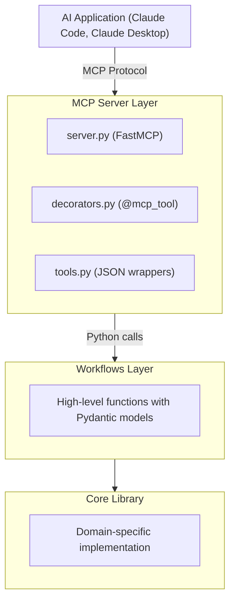

# MCP Integration Pattern for Scientific Software

This guide documents the pattern used to add MCP capabilities to PLEIADES, designed for reuse in other scientific packages (iBeatles, etc.).

> **Note**: This pattern was developed and tested with FastMCP 2.12.0+ and Pydantic 2.x.

## Architecture Overview

The MCP integration uses a layered architecture that keeps MCP concerns separate from core functionality:



**Key principle**: The MCP layer is a thin wrapper. All logic lives in the workflows and core layers, which work without MCP.

## Decorator Approaches

There are two ways to expose functions as MCP tools:

### Option A: FastMCP's Built-in Decorator (Simpler)

FastMCP 2.x provides a built-in `@server.tool()` decorator:

```python
from fastmcp import FastMCP

server = FastMCP("my-server")

@server.tool()
def my_function(path: str) -> dict:
    """This function is automatically exposed as an MCP tool."""
    return {"result": "success"}
```

**Use this when**: You're building a simple MCP server and don't need to switch backends.

### Option B: Custom Registry Decorator (PLEIADES Pattern)

PLEIADES uses a custom `@mcp_tool` decorator with a registry abstraction:

```python
from pleiades.mcp.decorators import mcp_tool

@mcp_tool(description="Analyze data")
def analyze(path: str) -> dict:
    return {"result": "success"}
```

**Use this when**:
- You want to decouple from specific MCP implementations
- You may switch backends in the future (FastMCP → another library)
- You need custom parameter descriptions or validation
- You want tools to be testable without MCP server running

**This guide documents Option B** (the custom decorator pattern) because it provides more flexibility for scientific software that may need to support multiple deployment scenarios.

## Implementation Steps

### Step 1: Create Workflows Module

Create high-level functions that orchestrate your domain logic. These should:
- Accept simple types (Path, str, basic types)
- Return Pydantic models for structured output
- Handle errors gracefully
- Be usable without MCP

```python
# src/yourpackage/workflows/analysis.py
from pathlib import Path
from pydantic import BaseModel

class AnalysisResult(BaseModel):
    success: bool
    metric: float | None
    error_message: str | None

def run_analysis(data_path: Path, method: str = "default") -> AnalysisResult:
    """High-level analysis function.

    This function is independent of MCP and can be used directly.
    """
    try:
        # Call your core library functions
        result = core_library.analyze(data_path, method)
        return AnalysisResult(
            success=True,
            metric=result.metric,
            error_message=None
        )
    except Exception as e:
        return AnalysisResult(
            success=False,
            metric=None,
            error_message=str(e)
        )
```

### Step 2: Create Decorator Module

Implement a registry-based decorator for tool registration:

```python
# src/yourpackage/mcp/decorators.py
from __future__ import annotations
from typing import Any, Callable, TypeVar
from copy import deepcopy

F = TypeVar("F", bound=Callable[..., Any])

_mcp_registry: dict[str, dict[str, Any]] = {}

def mcp_tool(
    func: F | None = None,
    *,
    name: str | None = None,
    description: str | None = None,
    parameter_descriptions: dict[str, str] | None = None,
) -> F | Callable[[F], F]:
    """Register a function as an MCP tool."""

    def decorator(f: F) -> F:
        tool_name = name or f.__name__
        tool_desc = description or (f.__doc__ or "").split("\n")[0]

        if tool_name in _mcp_registry:
            raise ValueError(f"Tool '{tool_name}' already registered")

        _mcp_registry[tool_name] = {
            "name": tool_name,
            "description": tool_desc,
            "func": f,
            "parameter_descriptions": parameter_descriptions,
        }
        return f

    if func is not None:
        return decorator(func)
    return decorator

def get_registered_tools() -> dict[str, dict[str, Any]]:
    """Return deep copy of tool registry."""
    return deepcopy(_mcp_registry)

def clear_registry() -> None:
    """Clear all registered tools (for testing)."""
    _mcp_registry.clear()
```

**Registry Scope Notes:**
- The registry is **global** within your package. All modules importing from `yourpackage.mcp.decorators` share the same registry.
- If multiple packages copy this pattern, each has its **own isolated registry** (different `_mcp_registry` variables).
- `clear_registry()` removes ALL tools from your package's registry - use it in tests to ensure clean state between test cases.
- Tools are registered at **import time** when Python executes the `@mcp_tool` decorator.

### Step 3: Create Tools Module

Wrap workflow functions with JSON serialization:

```python
# src/yourpackage/mcp/tools.py
from pathlib import Path
from typing import Any

from yourpackage.mcp.decorators import mcp_tool
from yourpackage.workflows import analysis

def _to_json(obj: Any) -> Any:
    """Convert objects to JSON-serializable format."""
    if obj is None or isinstance(obj, (str, int, float, bool)):
        return obj
    if isinstance(obj, Path):
        return str(obj)
    if hasattr(obj, "model_dump"):
        return obj.model_dump(mode="json")
    if isinstance(obj, dict):
        return {k: _to_json(v) for k, v in obj.items()}
    if isinstance(obj, (list, tuple)):
        return [_to_json(item) for item in obj]
    return str(obj)

# Note: Use domain-specific parameter names for your package
# PLEIADES uses: dataset_path, backend, isotopes
# Your package might use: data_path, method, options, etc.
@mcp_tool(
    description="Run analysis on a dataset",
    parameter_descriptions={
        "data_path": "Path to the dataset directory",
        "method": "Analysis method to use",
    },
)
def run_analysis(data_path: str, method: str = "default") -> dict:
    """MCP wrapper for analysis workflow."""
    try:
        result = analysis.run_analysis(Path(data_path), method)
        return {"status": "success", "data": _to_json(result)}
    except Exception as e:
        return {"status": "error", "error": str(e)}
```

### Step 4: Create Server Module

Set up FastMCP with auto-discovery:

```python
# src/yourpackage/mcp/server.py
from typing import Any

def discover_tools() -> dict[str, dict[str, Any]]:
    """Discover all registered MCP tools."""
    from yourpackage.mcp.decorators import get_registered_tools
    return get_registered_tools()

def register_tools(server: Any) -> None:
    """Register discovered tools with FastMCP server."""
    tools = discover_tools()
    for name, info in tools.items():
        server.tool(name=name, description=info["description"])(info["func"])

def get_server() -> Any:
    """Get FastMCP server instance."""
    from fastmcp import FastMCP
    return FastMCP("yourpackage-mcp")

def main() -> None:
    """Start the MCP server."""
    # Import tools module to trigger registration
    import yourpackage.mcp.tools  # noqa: F401

    server = get_server()
    register_tools(server)
    server.run()
```

### Step 5: Create Package Init

Handle optional dependency gracefully:

```python
# src/yourpackage/mcp/__init__.py
try:
    from fastmcp import FastMCP
    MCP_AVAILABLE = True
except ImportError:
    MCP_AVAILABLE = False
    FastMCP = None

def check_mcp_available() -> None:
    """Raise ImportError if MCP dependencies not installed."""
    if not MCP_AVAILABLE:
        raise ImportError(
            "MCP dependencies not installed.\n"
            "Install with: pip install yourpackage[mcp]"
        )

__all__ = ["MCP_AVAILABLE", "check_mcp_available"]
if MCP_AVAILABLE:
    __all__.append("FastMCP")
```

### Step 6: Create Module Entry Point

```python
# src/yourpackage/mcp/__main__.py
import sys

def run() -> None:
    """Entry point for python -m yourpackage.mcp"""
    try:
        from yourpackage.mcp.server import main
        main()
    except ImportError as e:
        print(f"Error: {e}")
        sys.exit(1)
    except KeyboardInterrupt:
        print("\nServer stopped.")
        sys.exit(0)

if __name__ == "__main__":
    run()
```

### Step 7: Configure pyproject.toml

```toml
[project.optional-dependencies]
# Pin to FastMCP 2.x - version 3.x may have breaking API changes
# The >=2.12.0 minimum ensures Pydantic 2.x compatibility
mcp = ["fastmcp>=2.12.0,<3"]

[project.scripts]
yourpackage-mcp = "yourpackage.mcp.server:main"
```

## Directory Structure

```
src/yourpackage/
├── mcp/
│   ├── __init__.py      # MCP_AVAILABLE check
│   ├── __main__.py      # Module entry point
│   ├── decorators.py    # @mcp_tool registry
│   ├── server.py        # FastMCP server setup
│   └── tools.py         # MCP tool wrappers
├── workflows/
│   ├── __init__.py
│   ├── models.py        # Pydantic models
│   └── analysis.py      # High-level functions
└── core/
    └── ...              # Domain-specific code
```

## Design Principles

### 1. Optional Dependency

MCP should never be required for core functionality:

```python
# Good: Graceful degradation
if MCP_AVAILABLE:
    from yourpackage.mcp import server

# Bad: Hard dependency
from yourpackage.mcp import server  # Crashes if fastmcp not installed
```

### 2. Thin Wrapper Layer

MCP tools should only:
- Convert types (str → Path)
- Call workflow functions
- Serialize results to JSON
- Handle errors

They should NOT contain business logic.

### 3. Consistent Output Format

All tools return the same structure:

```python
# Success
{"status": "success", "data": {...}}

# Error
{"status": "error", "error": "message"}
```

### 4. Type Safety

Use type hints everywhere:

```python
@mcp_tool(
    parameter_descriptions={
        "path": "Dataset path",
        "method": "Analysis method",
    },
)
def analyze(path: str, method: str = "default") -> dict:
    ...
```

### 5. Documentation via Decorators

Use `parameter_descriptions` to provide AI-friendly documentation:

```python
@mcp_tool(
    description="Analyze neutron resonance data using SAMMY fitting",
    parameter_descriptions={
        "dataset_path": "Path to directory containing resonance data files",
        "backend": "Execution backend: 'auto', 'local', 'docker', or 'nova'",
        "isotopes": "List of isotopes to analyze (e.g., ['Hf-177', 'Hf-178'])",
    },
)
def analyze_resonance(...):
    ...
```

## Testing

### Unit Tests for Decorators

```python
def test_mcp_tool_registration():
    from yourpackage.mcp.decorators import mcp_tool, get_registered_tools, clear_registry

    clear_registry()

    @mcp_tool(description="Test tool")
    def my_tool(x: int) -> int:
        return x * 2

    tools = get_registered_tools()
    assert "my_tool" in tools
    assert tools["my_tool"]["description"] == "Test tool"
    assert my_tool(5) == 10  # Original function works
```

### Integration Tests

```python
def test_tool_execution():
    from yourpackage.mcp.tools import run_analysis

    result = run_analysis("/path/to/test/data")
    assert result["status"] in ("success", "error")
    if result["status"] == "success":
        assert "data" in result
```

## Common Pitfalls

### 1. Import Timing for Decorator Registration

Import tools module inside `main()`, not at module level. This ensures decorators are executed at the right time:

```python
# Good: Import inside main() triggers registration before server starts
def main():
    import yourpackage.mcp.tools  # Triggers @mcp_tool decorator registration
    ...

# Bad: Module-level import may run before registry is ready
import yourpackage.mcp.tools
def main():
    ...
```

### 2. Non-Serializable Returns

Always convert complex types:

```python
# Bad: Returns Path object
return {"path": Path("/some/path")}

# Good: Convert to string
return {"path": str(Path("/some/path"))}
```

### 3. Missing Error Handling

Always wrap workflow calls:

```python
# Bad: Exception crashes MCP
result = workflow.analyze(path)
return {"data": result}

# Good: Return error in standard format
try:
    result = workflow.analyze(path)
    return {"status": "success", "data": result}
except Exception as e:
    return {"status": "error", "error": str(e)}
```

## Estimated Code Size

For a minimal MCP integration (simplified version of what PLEIADES uses):

| Component | Lines of Code (Minimal) | Lines of Code (Full-featured) |
|-----------|------------------------|------------------------------|
| decorators.py | ~50 | ~250 (with validation, docs) |
| server.py | ~40 | ~300 (with schema generation) |
| tools.py | ~30 per tool | ~80 per tool (with serialization) |
| __init__.py | ~20 | ~30 |
| __main__.py | ~15 | ~25 |
| **Total** | ~150 + 30/tool | ~600 + 80/tool |

The minimal estimates above are for a basic implementation. Production code (like PLEIADES) typically includes additional features: comprehensive type validation, detailed JSON schema generation, robust error handling, and extensive documentation.

> **Note**: These estimates exclude test code. A thorough test suite (unit tests for decorators, server, and tools; integration tests for end-to-end workflows) typically adds 200-500 additional lines depending on coverage requirements.

## References

- [MCP Protocol Specification](https://modelcontextprotocol.io/)
- [FastMCP Documentation](https://gofastmcp.com/)
- [PLEIADES MCP Implementation](https://github.com/lanl/PLEIADES/tree/next/src/pleiades/mcp)
